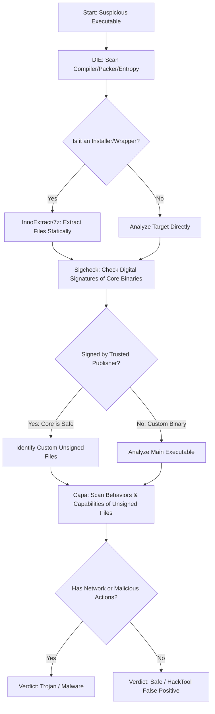

# Static Binary Analysis & False Positive Triage Workflow

This repository documents a robust, command-line-driven static binary analysis workflow used to triage suspicious executable files—specifically focusing on resolving false-positive detections in cracked/repacked software installers.

The workflow details our analysis of the installer wrapper `Bnd.exe` (Bandicam Repack), explaining why it triggers a high rate of detections on VirusTotal (33/61) while being locally safe.

---

## 🛠️ Analysis Tools Used

All tools utilized in this workflow are CLI-compatible utilities that run via PowerShell:

1.  **Detect It Easy (DIE)** (`diec`): File format identification, entropy calculation (packing/encryption detection), compiler, and installer detection.
2.  **InnoExtract** (`innoextract`): CLI extractor that unpacks Inno Setup installer cabinets without executing their code.
3.  **Sysinternals Sigcheck** (`sigcheck`): Digital signature validation, publisher authentication, link-date tracking, and cryptographic hash generation.
4.  **Mandiant Capa** (`capa`): Rule-based static behavior and capability identifier (e.g. process injection, obfuscation, anti-analysis checks, network functionality).
5.  **Sysinternals Strings** (`strings`): CLI utility to dump ASCII/Unicode strings from binary files.

---

## 📈 The Step-by-Step Triage Workflow

This triage methodology can be generalized to evaluate any suspicious Windows binary:



### Step 1: Detect File Type and Packing (`DIE`)
Check the target's packaging using Detect It Easy to determine if it is packed or wraps other files:
```powershell
diec -d -u -e -i Bnd.exe
```
*Result*: Flagged as an Inno Setup installer stub with a highly-packed overlay (LZMA cabinet) containing the actual program files.

### Step 2: Unpack Installer Statically (`InnoExtract`)
Extract files from the installer cabinet without executing it. This isolates the crack loader from the main application:
```powershell
innoextract -d .\extracted Bnd.exe
```
*Result*: Extracted the core files, showing original Bandicam files and custom crack loaders (`winspool.drv`, `bcact.exe`).

### Step 3: Check Signatures and Provenance (`Sigcheck`)
Verify if the main application files were modified or are authentic copies from the vendor:
```powershell
sigcheck -accepteula -a -h .\extracted\app\bdcam.exe
```
*Result*: Core binary `bdcam.exe` is **Verified Signed** by **Bandicam Company Corp** with a valid certificate. This confirms the original program is untouched.

### Step 4: Map Static Capabilities of Unsigned Files (`Capa`)
Analyze the custom loader DLLs and setup executables to identify their behavioral capabilities:
```powershell
capa .\extracted\app\winspool.drv
capa .\extracted\tmp\bcact.exe
```
*Result*:
*   `winspool.drv` serves as a **DLL Side-Loading Hook**. It proxies standard spooler commands but patches Bandicam's memory locally to bypass registration.
*   `bcact.exe` is a standard offline generator using local encryption schemas (Blowfish, MD5, XOR) to create license files.
*   **Crucial Finding**: Neither binary contains **any** network sockets, DNS resolution, connection routines, or remote access capabilities.

---

## 🧠 Core Analysis Questions

### Q1: Can any future binary (random positive) be analyzed this way?
**Yes.** This pipeline is standard for triaging PE binaries. 
*   If the binary is an installer wrapper (Inno Setup, NSIS, Wix, MSI), you extract it statically using `innoextract`, `7-Zip`, or `lessmsi`.
*   If the binary is packed/obfuscated (UPX, VMProtect, Themida), `DIE` will tell you, indicating that dynamic sandbox analysis or deobfuscation is needed next.
*   For unpacked components, `sigcheck` establishes provenance, while `capa` rapidly maps features (networking, credentials stealing, persistence).

### Q2: How much AI evaluation is necessary for interpretation?
*   **AI is highly necessary for contextual triage**: A static scanner outputting raw API lists (e.g. `VirtualAlloc`, `WriteProcessMemory`) cannot tell you *why* they are called.
*   **Interpretation Context**: An AI can connect the dots:
    *   *Observation*: "Blowfish, MD5, and XOR are present in `bcact.exe`."
    *   *Interpretation*: These cryptographic tools are used locally to generate license keys matching the software's validation logic, rather than encrypting files (ransomware).
    *   *Observation*: "Unsigned `winspool.drv` sits next to a signed `bdcam.exe`."
    *   *Interpretation*: This is a classic DLL Side-Loading crack wrapper, not a stealthy system injector.
*   **Where AI fails**: AI cannot dynamically run the program to see if it executes anti-analysis triggers or extracts a second-stage payload hidden inside an image. If a binary is heavily packed, AI has to rely on sandbox behavior logs.

### Q3: Why do Antivirus programs flag these files if they are signed and have no internet access?
This is the most common point of confusion for users. Why flag `winspool.drv` or `Bnd.exe` as a "Trojan" when simple checks show they are local-only?

1.  **Proven Provenance is NOT Perfect**: A valid signature only proves a file was signed by a specific certificate. It does not prove the file is safe. Stolen or leaked certificates are frequently used to sign malware (e.g., the Lapsus$ leak of NVIDIA certificates).
2.  **Technique-Based Heuristics (TTPs)**: The crack DLL (`winspool.drv`) uses DLL side-loading to hook into `bdcam.exe` and patch its memory. Heuristic engines see a process injecting code into a memory page with execute/read/write permissions (`PAGE_EXECUTE_READWRITE`). Because *Trojan injectors use the exact same techniques*, automated scanners flag them under generic Trojan names (e.g., `Trojan:Win32/Tedy!MTB`). Scanners cannot differentiate "intent" (cracking a license vs. stealing passwords) based on low-level API patterns.
3.  **No Internet Access ≠ No Threat**: Scanners cannot assume a local-only binary is safe. Ransomware (which destroys local files) does not require internet access to execute its payload. Additionally, malware can perform **Process Hollowing** to inject code into legitimate network-enabled processes (like `explorer.exe`), indirectly accessing the internet.

### Q4: Is there an element of AVs "providing a service" to software companies against piracy?
Yes, there is a documented commercial alignment between the cybersecurity industry and software companies:

*   **Classification Strategy**: Antivirus vendors categorize cracks, keygens, and activators as **HackTools**, **Riskware**, or **PUA (Potentially Unwanted Applications)**. 
*   **The Heuristic Scary Label**: In practice, many scanners label these tools under critical classifications (like `Trojan.Gen` or `Trojan:Win32/...`) rather than the more accurate `HackTool` or `Riskware`. This serves a dual purpose:
    1.  **Legal Liability**: Since cracked software is modified by anonymous third parties, AV vendors cannot guarantee its integrity. Labeling it malicious protects the AV vendor from liability if a user gets infected.
    2.  **Anti-Piracy Partnership**: Software vendors (represented by groups like the BSA Software Alliance) work closely with security companies. Flagging licensing bypasses as active threats acts as a powerful deterrent. By "effectively lying" (or over-classifying) crack techniques as viruses, security vendors help enforce copyright compliance under the banner of device protection.
